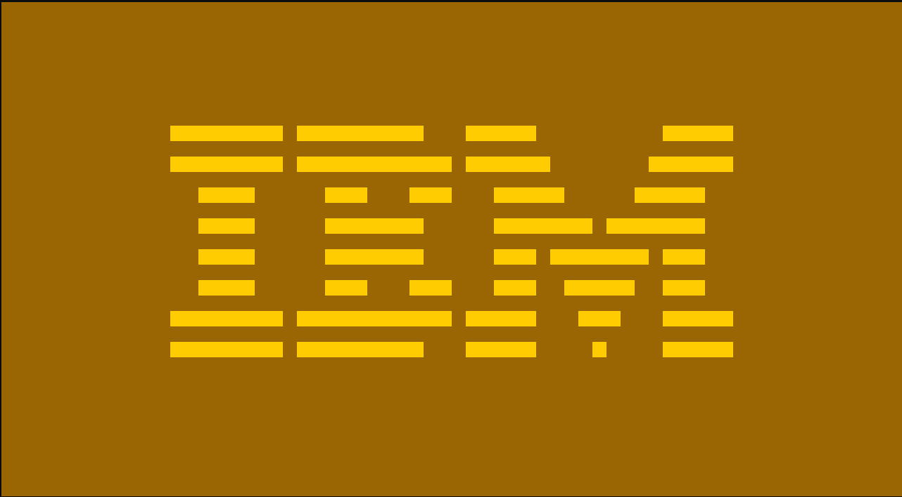

# chip8.c
Chip-8 virtual machine that runs on your terminal

# Quick start

### Linux / MinGW
```bash
$ git clone https://github.com/ennkp/chip8.c
$ cc main.c -o chip8 -O3
```

### MSVC
```powershell
> git clone https://github.com/ennkp/chip8.c
> cl main.c /Fechip8.exe /O2 /link User32.lib
```

# Running chip8
```
$ chip8 path/to/rom [options]
```

Use ```-h``` for a full list of config options
```
$ ./chip8 -h
Usage: chip8 <rom> [options]
Options:
    --help, -h             Display this information.
    -ips <arg>             Instructions per second to use, must be greater or equal to FPS (Default: 700).
    -fps <arg>             Frames per second to use (Default: 60).
    -qshift-use-vy         Quirk: set VY to VX before bit shifting operations.
    -qbxnn                 Quirk: use BXNN version of BNNN (Jump with offset) operation.
    -qinc-index            Quirk: increment index register on memory load/store operations.
    -fg <hexcode>          Set pixel 'on' color (foreground). Eg: FF0000 for red
    -bg <hexcode>          Set pixel 'off' color (background). Eg: 00FF00 for green
```

# Examples
Emulating the [Octo](https://github.com/JohnEarnest/Octo) theme using the ```-fg``` and ```-bg``` flags

```shell
$ ./chip8.exe ./roms/IBM_logo.ch8 -fg ffcc01 -bg 996601
```



### References
[Guide to making a CHIP-8 emulator](https://tobiasvl.github.io/blog/write-a-chip-8-emulator/)